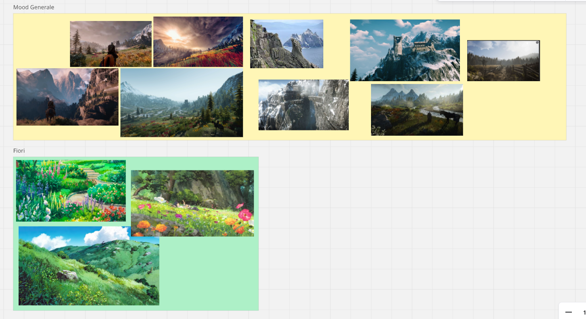
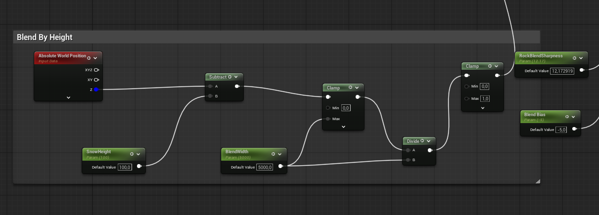
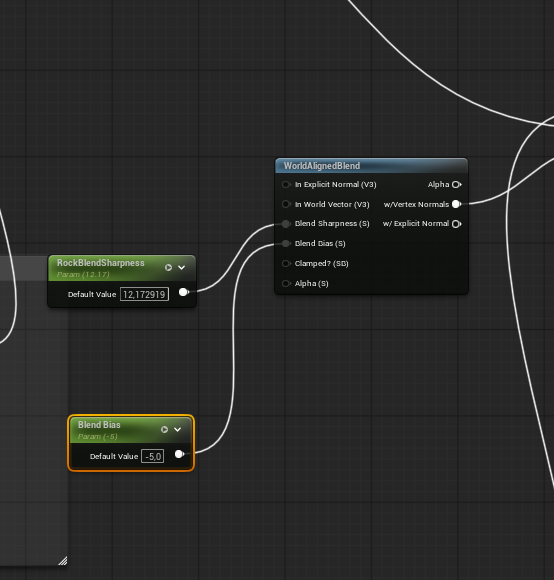
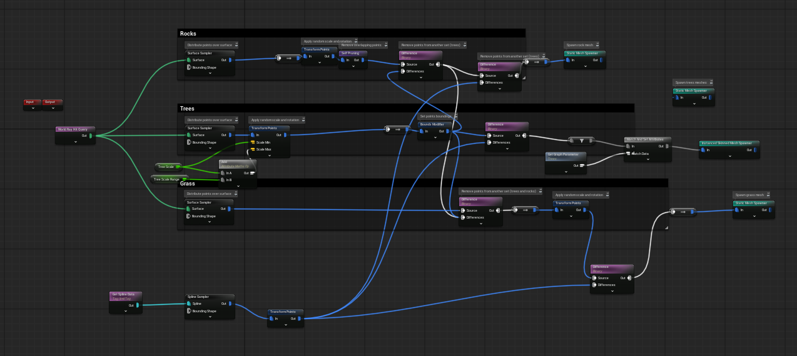
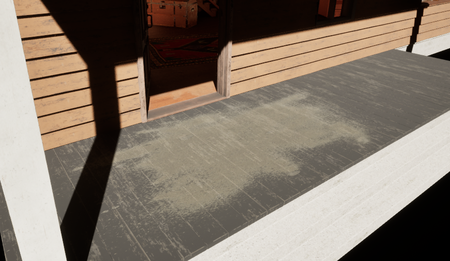
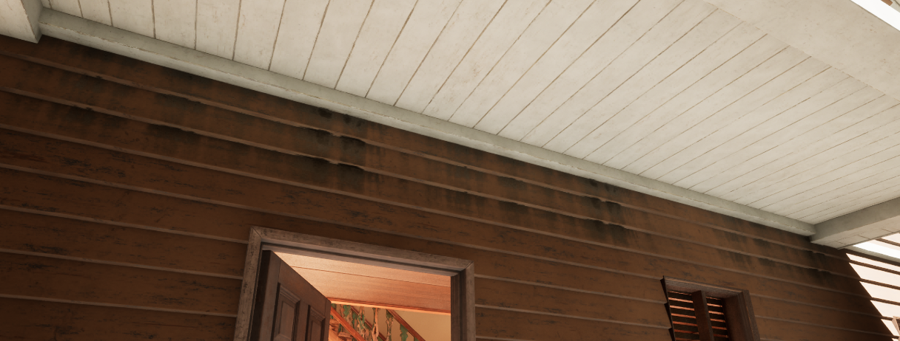
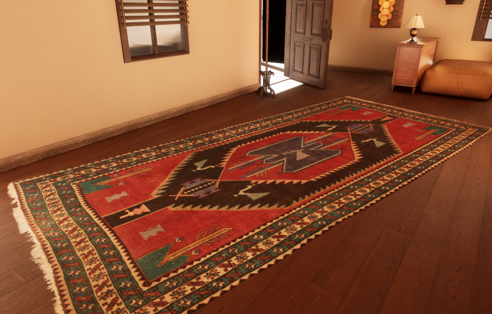
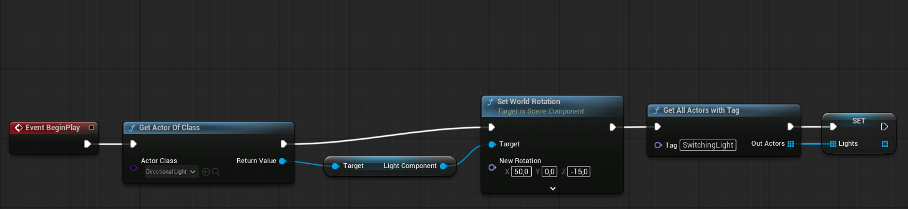
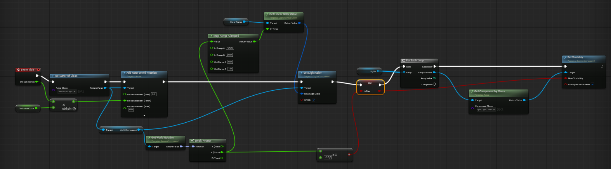

# 1. 🏗️ Panoramica dell'ambiente

## Final Showreel


---
## La Scena e la Direzione Artistica
L'obiettivo è stato sviluppare un ambiente 3D in Unreal Engine 5. La scena esplora il contrasto tra una vallata naturale con picchi montuosi innevati (exterior) e una zona inferiore ricca di vegetazione con un'architettura rustica (interior). 

Le ispirazioni principali sono state le ambientazioni naturali e fiabesche di Hayao Miyazaki ("Il Castello Errante di Howl", "La Città Incantata"). 

Per l'estetica della flora abbiamo puntato a un effetto luminoso e morbido ispirato all'animazione giapponese, unito al mondo di "The Witcher 3" per l'uso di materiali e dettagli realistici.

## Moodboard & Concept Art

🔗 **[Guarda la Moodboard completa su Miro](https://miro.com/app/board/uXjVGxbIRlA=/?share_link_id=457435760422)**

## Il punto di partenza: Greyboxing


## Showcase: Fiori


## Showcase: La Casa-1


## Showcase: La Casa-2


# 2. 🎯 Decisioni Chiave

## Le scelte che hanno definito la scena

1. **100% Procedurale e Scalabile:** In un mondo enorme, la scelta radicale è stata quella di non piazzare *nessun asset a mano*. Tutto è generato proceduralmente (inclusi i materiali e gli asset scatterati) per creare un'oasi viva all'interno di una foresta montana. Questo setup è stato ingegnerizzato per essere facilmente scalabile e riciclabile per le consegne future.
2. **Controllo tramite Spline:** L'intero layout è governato dalle Spline. Queste delimitano i sentieri, i confini della casa e il perimetro del giardino, dettando al PCG le regole precise di spawn.
3. **Modularità e Rework degli Interni:** Per gli interni e le strutture, l'approccio è stato rigorosamente modulare. Abbiamo prelevato asset da vari pack e li abbiamo ampiamente reworkati per farli funzionare in modo coeso nella nostra scena.

# 3. 🛠️ Tool Breakdown

## Generazione del terreno & Auto-Material
La base del mondo è stata costruita concentrandosi su montagne con picchi aguzzi e segni di erosione glaciale.

* **Heightmaps:** Come base per ottenere un terreno realistico, sono state impiegate Heightmap esterne ad altissima fedeltà.
* **Landscape Auto-Material:** Sviluppato per applicare automaticamente una texture di neve sulle cime (basandosi sull'asse Z e le normali), lasciando la roccia sui pendii ripidi e il terreno fertile a valle.

## Landscape Node Graph 1

## Landscape Node Graph 2

## Foliage, PCG & Spline Workflow
L'intera vegetazione è gestita tramite **PCG**, guidato da un rigoroso **Spline Workflow** per tracciare i confini del prato, i sentieri e l'area della casa.

* **Alberi e Megaplants:** I pini sono stati generati usando i nuovi asset *Megaplants*, integrati nel volume PCG con regole spaziali per limitare lo spawn alle zone di transizione.

## Showcase PCG: Sentiero Spline


## Showcase PCG: Grass Volume


## Showcase PCG: Trees Volume


## World Space Texturing

I moduli della casa presentano delle texture mappate in world space, e non in base alle coordinate UV, così da risultare in un asset consistente e che non presenta nella sua architettura soluzioni di continuità.



## Decals

Decorazioni e usura sono stati "stampati" sulle superfici aggiungendo micro-dettagli realistici senza pesare sulla geometria.

## Celestial Night and Day Actor
Per gestire l'illuminazione dinamica e il ciclo vitale del mondo abbiamo implementato il plugin **Celestial Night and Day Actor**. Questo strumento ci ha permesso di creare un ciclo temporale fisicamente accurato, che fa reagire l'intero ambiente (cielo, esposizione, attivazione delle luci) al passare del tempo, automatizzando le transizioni.

## Project Cleaner
Vista l'enorme quantità di asset scaricati per testare la modularità e le variazioni di props, il peso del progetto rischiava di diventare ingestibile. Abbiamo utilizzato il plugin **Project Cleaner** per individuare ed eliminare tutti gli asset "orfani" (non utilizzati in nessuna mappa), ottimizzando drasticamente lo spazio e mantenendo la repository snella per il controllo versione su Git.

# 4. 💡 Breakdown dell'Illuminazione

## Atmosfera, Vento & Illuminazione
L'atmosfera gioca un ruolo cruciale nella scala della scena.

* **Nebbia Volumetrica:** Una *Exponential Height Fog* fitta ristagna in basso nella valle e si dirada salendo.
* **Nuvole Volumetriche & God Rays:** Nuvole pesanti permettono alla luce di filtrare creando "raggi divini".
* **Vento Dinamico:** I materiali reagiscono in tempo reale al vento, aumentando la vitalità del livello.

## Ciclo Giorno/Notte (Logica)
L'illuminazione non è statica ma è governata da un sistema tramite il quale si definiscono i periodi di giorno/notte dell'ambiente. Con l'arrivo della notte, tutte le luci col tag "SwitchingLight" vengono accese. L'ambiente è vivo, e reagisce ai cambi di orario.

## Ciclo Giorno/Notte: Visualizzazione


## Dettagli Ambientali


# 5. 📦 Asset Breakdown

## Organizzazione del Content Browser
La struttura del progetto riflette l'eterogeneità degli asset integrati, mantenendo una gerarchia pulita per le diverse tipologie di risorse impiegate:

* **Terreno e Landscape:** `MWLandscapeAutoMaterial`, `MountainScene`.
* **Flora e PCG:** `Megaplant_Library`, `Mobile_Trees`, `HighPoly_Tree_Model`, `Tree`.
* **Architettura ed Esterni:** `RuralHouse`, `Scene_Saloon`.
* **Interni e Props:** `Cigar_room`, `FreeFurniturePack`, `Megascans`, `Scarecrow`, `Street_Lamp`, `Windmill`, `Wall_decoration_of_grapes`.

## Provenienza e Tipologia
Abbiamo combinato asset ad alta fedeltà per ottimizzare i tempi di produzione:

* **Heightmaps:** [Motion Forge Pictures - Height Maps realistiche](https://www.motionforgepictures.com/height-maps/)
* **Megascans e Decorazioni:** [Quixel Antique Rug](https://www.fab.com/listings/aac95468-ab2f-4950-964c-45c0bf63068c), [Saloon Interior](https://www.fab.com/listings/57991a62-f98f-4c6a-9b94-a74ec12f242e), [TijerinArt - Wall decoration](https://www.fab.com/listings/43cce1fc-45e1-4c25-ac64-cd95dc577c61)
* **Strutture ed Esterni (Fab.com):** * [Laglanz - Modular Rural House & Pine Forest](https://www.fab.com/listings/a081748c-6a49-4ba4-9008-9b10fadf8f73)
  * [Hane Studios - Cigar Room Environment](https://www.fab.com/listings/4da78da6-44b3-4adf-8883-219fe17b44d4)

## Tutorial Tecnici di Riferimento
1. [You Won't Believe How Easy City Streets Can Be in UE5 Using PCG](https://www.youtube.com/watch?v=h00fXTGmqxI)
2. [UE5 Landscape Auto Material - The Beginning](https://www.youtube.com/watch?v=or2TJI2rwpA)
3. [NCA TEMPLATE | UE 5 | PCG Megaplants](https://www.youtube.com/watch?v=vY20bciBDsU)
4. [UE5 Megaplants - How to Use in PCG](https://youtu.be/4TZG9fBEiR0)

# 6. 🔥 Le sfide maggiori

## Le criticità affrontate

* **PCG Spline Routing:** Integrare le Spline nel PCG ha richiesto di capire come instradare i dati spaziali e debuggare visivamente i punti di spawn prima della generazione.
* **Landscape & Nanite:** Abilitare Nanite sul Landscape ha introdotto sfide prestazionali enormi, risolte scendendo a compromessi e bilanciando i sample del terreno.
* **Integrazione Megaplants:** Questa feature ci ha costretto ad abbandonare i classici "Static Mesh Spawner" nel PCG in favore di un nuovo e complesso sistema di istanziazione.
* **Mie Scattering:** L'illuminazione volumetrica slavava i colori della vegetazione in lontananza. Risolto abbassando la scala del *Mie Scattering* nei settaggi atmosferici.
* **Uniformità negli interni:** La costruzione degli interni è avvenuta impiegando asset provenienti da pack diversi, il che ha portato alla necessità di modificare i materiali per creare coerenza e dare un feel caldo, accogliente e soprattuto coeso alla casa.