# ASSIGNMENT 2 

*Ascesa, declino e rinascita di un'idea*

---

## La reference: Expedition 33

**Obiettivo:** ricreare la scena del litigio tra Gustave e Lune.

::: {.columns}
::: {.column width="50%"}
<!-- SEGNAPOSTO: screenshot del video YouTube (Uk1UO-nbqVg) -->
<!-- Inserire: assets/ref_expedition33.jpg -->
{width=100%}
:::
::: {.column width="50%"}
<!-- SEGNAPOSTO: screenshot di gioco con Gustave e Lune -->
<!-- Inserire: assets/ref_gustave_lune.jpg -->
{width=100%}
{width=100%}

:::
:::

---

## Tentativo 1 — MetaHuman Editor diretto

Partire dalle **mesh base di MH** e "copiare" il volto a occhio.

::: {.columns}
::: {.column width="50%"}
<!-- SEGNAPOSTO: screenshot MH editor con il viso in lavorazione -->
<!-- Inserire: assets/mh_editor_attempt.jpg -->
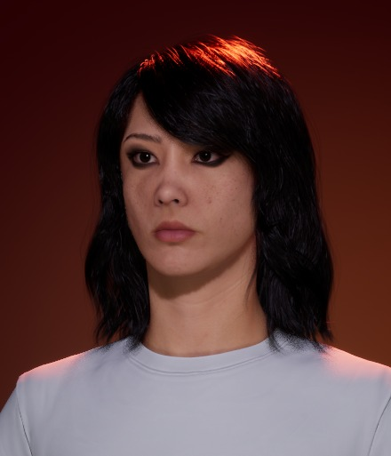{width=50%}
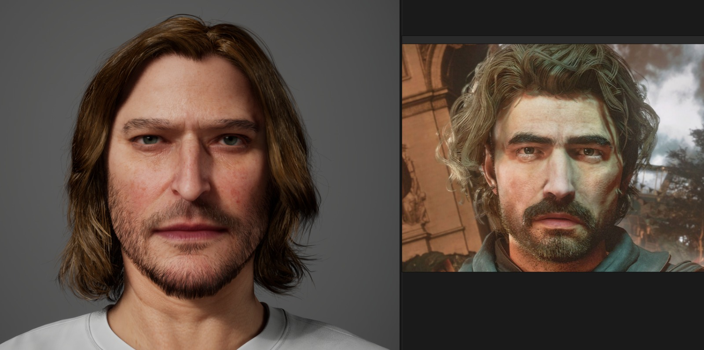{width=100%}
:::
::: {.column width="50%"}
**Problemi riscontrati:**

- Personalizzazione limitata
- Effetto **uncanny valley**: modificata una parte, il resto non torna più
- Impossibile ottenere una somiglianza credibile
:::
:::

---

## Tentativo 2 — FaceBuilder su Blender

**Workflow:** scan facciale → MH Identity → import in Unreal

<!-- SEGNAPOSTO: schema/diagramma del workflow -->
<!-- Inserire: assets/workflow_facebuilder.png -->
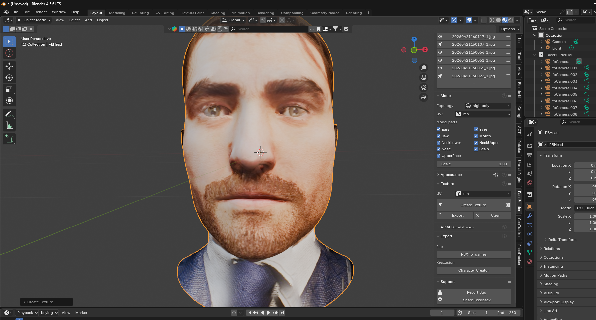{width=70% fig-align="center"}

---

## Tentativo 2 — Risultato

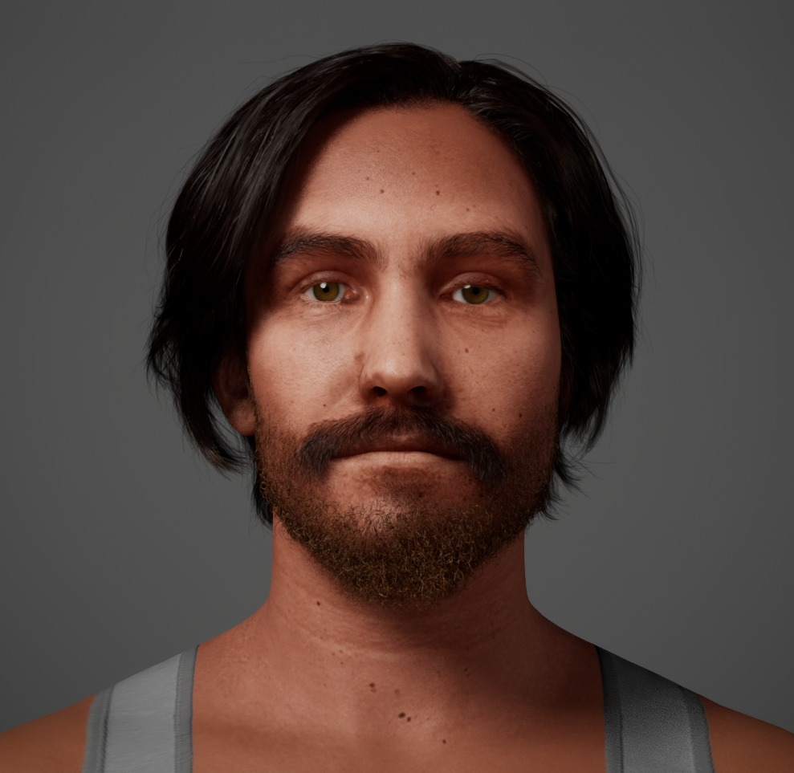{width=70% fig-align="center"}


---

## Soluzione - Metahuman di Dario e Federico

Si porta il concetto di "post mortem" all'estremo: abbiamo realizzato i nostri metahuman per farli discutere sul precedente fallimento.

::: {.columns}
::: {.column width="50%"}
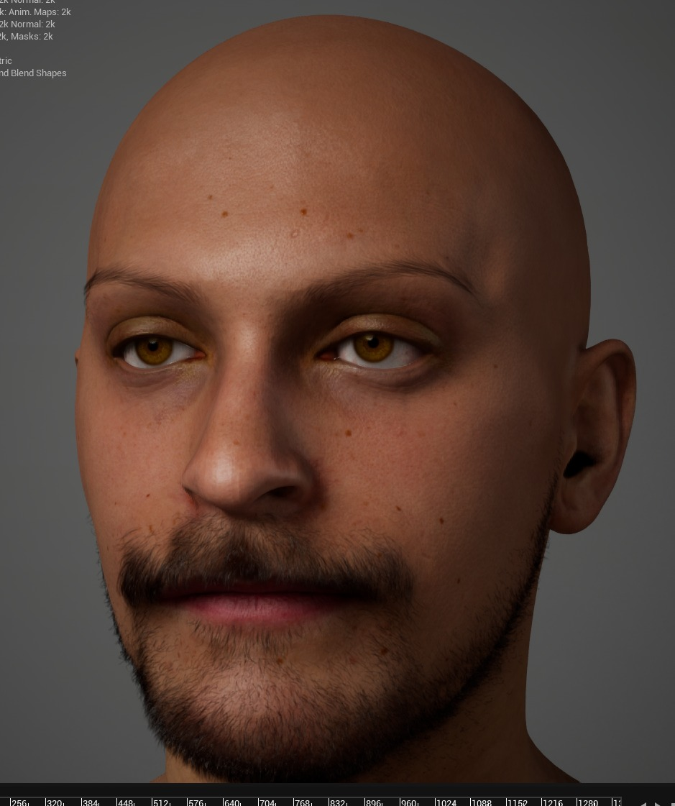
:::
::: {.column width="50%"}
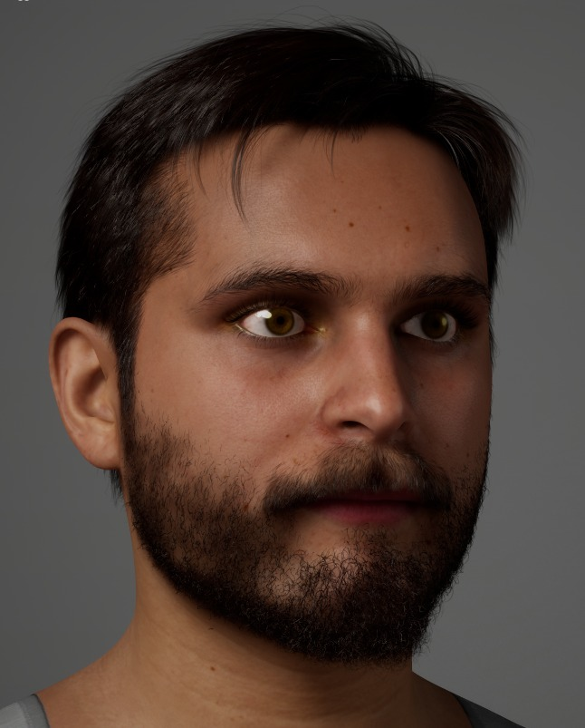
:::
:::

---

## MetaHuman Creator Authoring

Documentazione delle scelte effettuate nel Creator per personalizzare i personaggi oltre i preset.

::: {.columns}
::: {.column width="50%"}
**Dettagli Tecnici:**
- **Skin:** Parametri di texture e rugosità.
- **Eyes:** Configurazione dell'iride e del colore.
- **Hair:** Scelta dei preset e modifiche ai materiali.
:::
::: {.column width="50%"}
<!-- SEGNAPOSTO: Screenshot MH Creator (Pannelli Skin/Eyes/Hair per dimostrare l'authoring e le modifiche effettuate sui preset) -->
<!-- Inserire: assets/mh_creator_panels.jpg -->
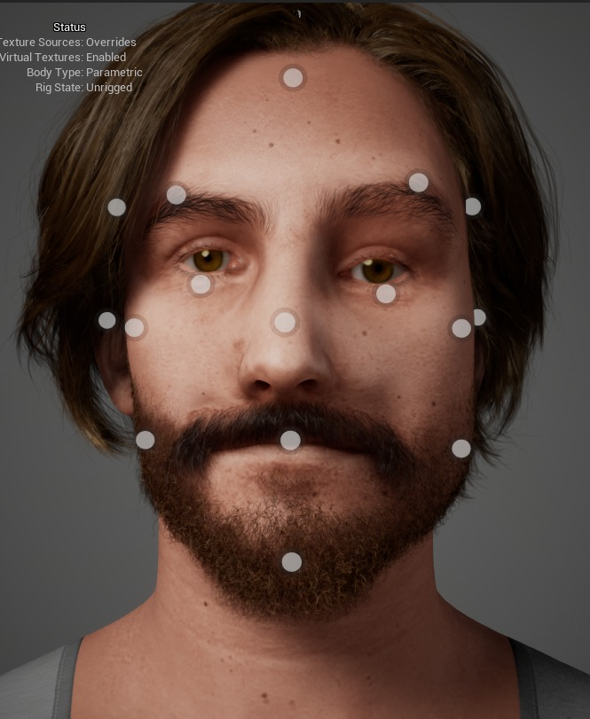{width=100%}
:::
:::

---

## Character Creation Workflow


```
Video selfie rotante  →  Reality Scan  →  Scan pulito
      →  MH Identity  →  MetaHuman base  →  Vestiti + capelli
```

::: {.columns}
::: {.column width="50%"}
**Federico**

- Capelli importati da asset esterni
- Clothes importati e fittati

<!-- SEGNAPOSTO: before/after Federico (scan → MH) -->
<!-- Inserire: assets/fede_scan_vs_mh.jpg o .gif -->
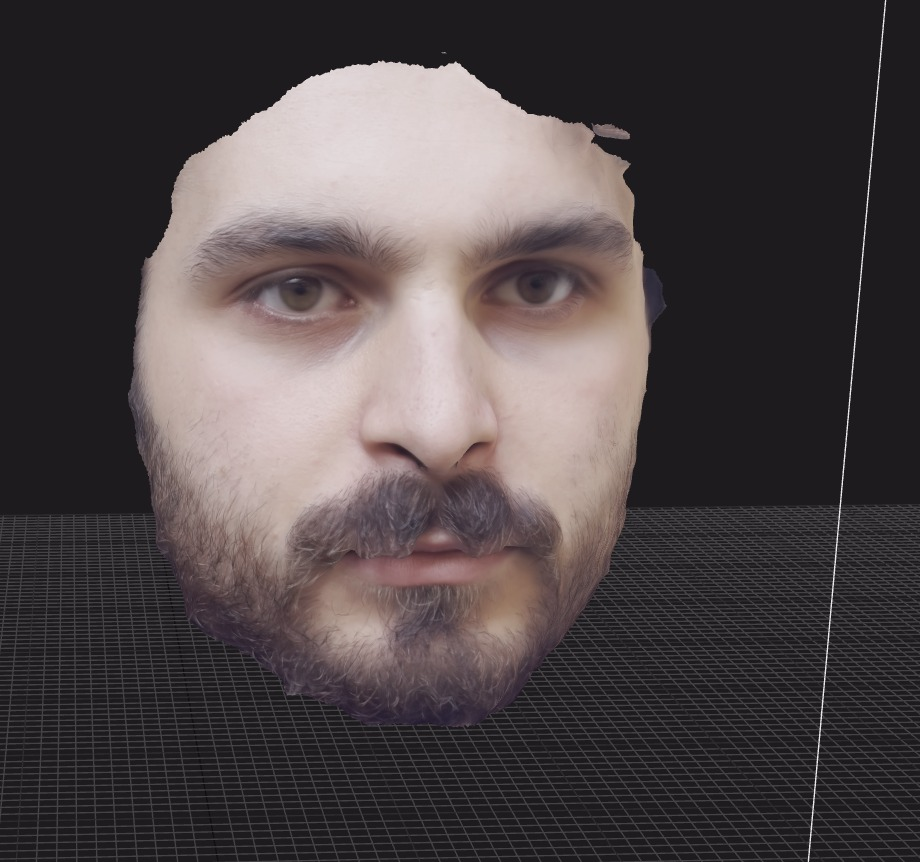{width=100%}
:::
::: {.column width="50%"}
**Dario**

- Barba e baffi da libreria MH
- Clothes importati e fittati

<!-- SEGNAPOSTO: before/after Dario (scan → MH) -->
<!-- Inserire: assets/dario_scan_vs_mh.jpg o .gif -->
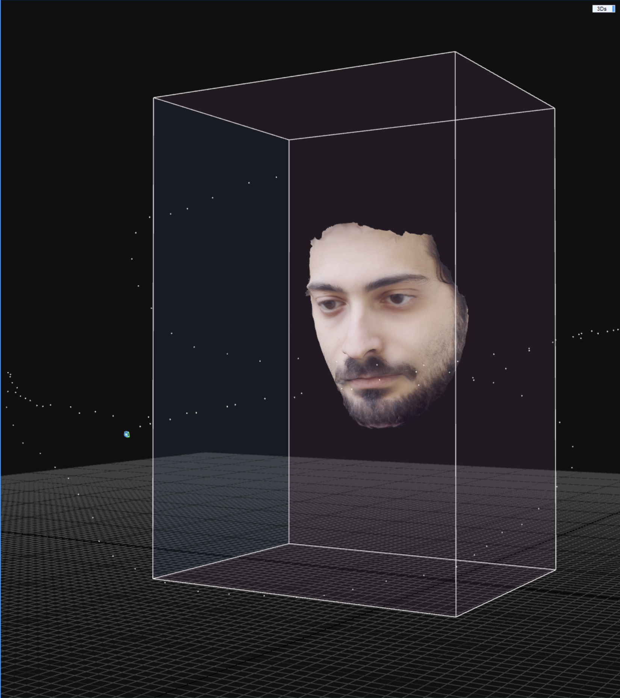{width=100%}
:::
:::

---

## Capelli su Blender — e perché l'abbiamo abbandonato

**Tentativo:** Blender → Alembic → Groom Asset in Unreal

::: {.columns}
::: {.column width="50%"}
<!-- SEGNAPOSTO: screenshot del lavoro capelli su Blender (venuto bene) -->
<!-- Inserire: assets/hair_blender.jpg -->
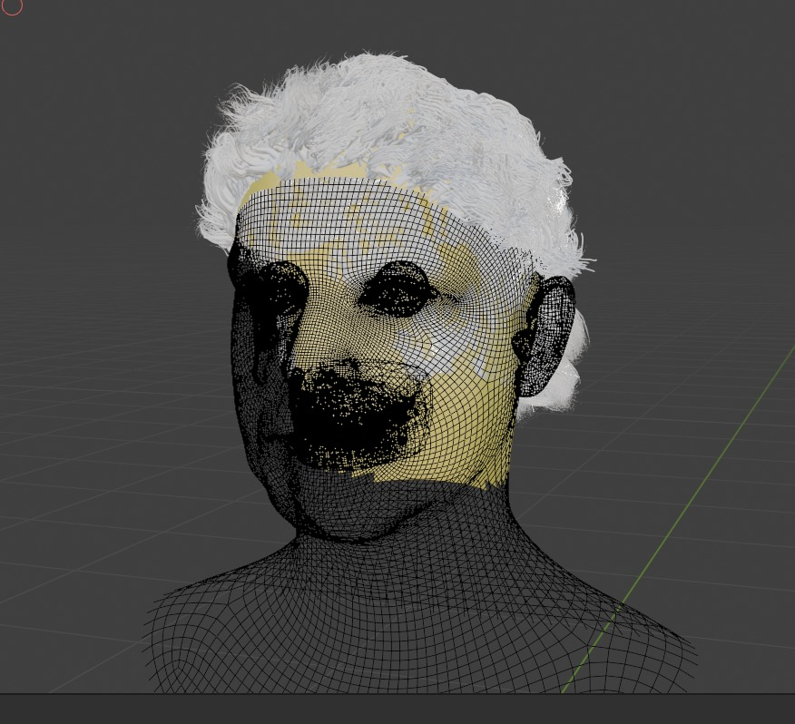{width=100%}

*Il lavoro su Blender era venuto bene...*
:::
::: {.column width="50%"}
<!-- SEGNAPOSTO: screenshot del problema di import in Unreal -->
<!-- Inserire: assets/hair_import_fail.jpg -->
{width=100%}

*...ma l'import in Unreal era un incubo.*
:::
:::

---

## IK Rig & Retargeting

Processo di trasferimento delle animazioni catturate sui nostri MetaHuman.

::: {.columns}
::: {.column width="50%"}
**Passaggi Tecnici:**
- Definizione delle **IK Chains** nel rig sorgente e target.
- Mappatura delle catene.
- Aggiustamento della **Retarget Pose** per far combaciare le proporzioni.
:::
---

## Lessons Learned — Post-Mortem

::: {.columns}
::: {.column width="50%"}
### **Cosa ha funzionato ✅**
- **Mesh to MetaHuman:** somiglianza fotorealistica rapida.
- **Cartwheel:** workflow mocap pulito ed efficace.
- **Live Link Face:** espressività superiore (depth data).
- **Pivot creativo:** trasformare il fallimento in narrazione.
:::
::: {.column width="50%"}
### **Criticità e Problemi ❌**
- **Uncanny Valley:** l'editing manuale a occhio non regge il confronto.
- **Blender Groom Asset:** pipeline Alembic instabile in Unreal.
- **IK Retargeting:** distorsioni complesse su vestiti custom.
- **Optimization:** gestione dei LOD con asset esterni importati.
:::
:::

---

# Grazie per l'attenzione!

*Federico & Dario*

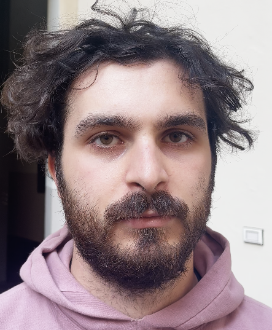{width=80% fig-align="center"}
