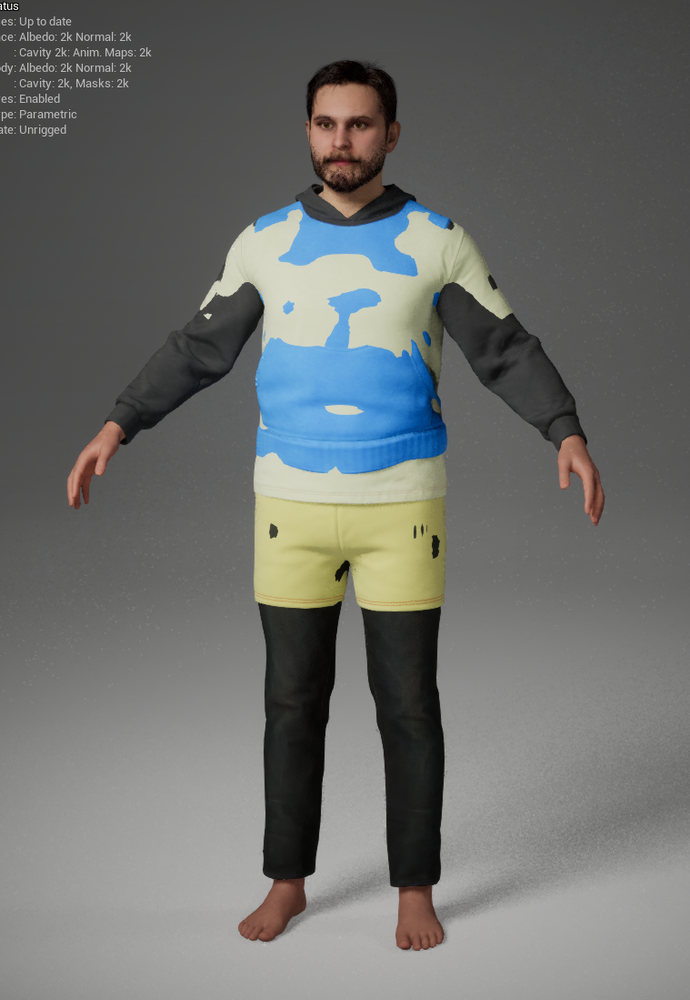
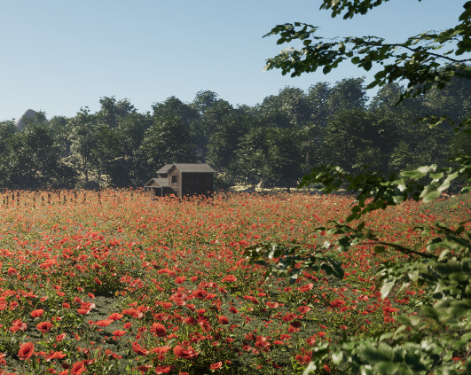
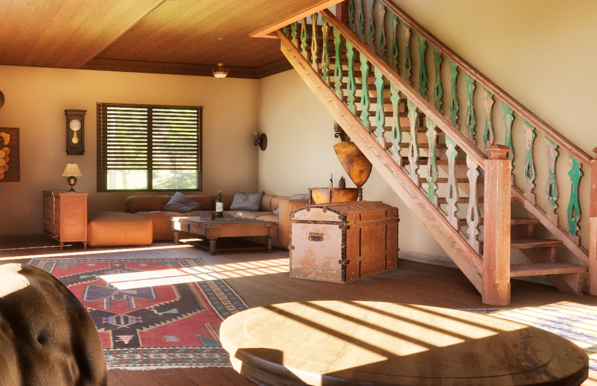

# ASSIGNMENT 2 

*Ascesa, declino e rinascita di un'idea*

---

## La reference: Expedition 33

**Obiettivo:** ricreare la scena del litigio tra Gustave e Lune.

::: {.columns}
::: {.column width="50%"}
<!-- SEGNAPOSTO: screenshot del video YouTube (Uk1UO-nbqVg) -->
{width=100%}
:::
::: {.column width="50%"}
<!-- SEGNAPOSTO: screenshot di gioco con Gustave e Lune -->
{width=100%}
{width=100%}

:::
:::

---

## Tentativo 1 — MetaHuman Editor diretto

Partire dalle **mesh base di MH** e "copiare" il volto a occhio.

::: {.columns}
::: {.column width="50%"}
<!-- SEGNAPOSTO: screenshot MH editor con il viso in lavorazione -->
{width=50%}
{width=100%}
:::
::: {.column width="50%"}
**Problemi riscontrati:**

- Personalizzazione limitata
- Effetto **uncanny valley**: modificata una parte, il resto non torna più
- Impossibile ottenere una somiglianza credibile
:::
:::

---

## Tentativo 2 — FaceBuilder su Blender

**Workflow:** scan facciale → MH Identity → import in Unreal

<!-- SEGNAPOSTO: schema/diagramma del workflow -->
{width=70% fig-align="center"}

---

## Tentativo 2 — Risultato

{width=70% fig-align="center"}


---

## Soluzione - Metahuman di Dario e Federico

Si porta il concetto di "post mortem" all'estremo: abbiamo realizzato i nostri metahuman per farli discutere sul precedente fallimento.

::: {.columns}
::: {.column width="50%"}

:::
::: {.column width="50%"}

:::
:::

---

## Soluzione - Metahuman di Dario e Federico

Si porta il concetto di "post mortem" all'estremo: abbiamo realizzato i nostri metahuman per farli discutere sul precedente fallimento.

::: {.columns}
::: {.column width="50%"}

:::
::: {.column width="50%"}

:::
:::

---

## MetaHuman Creator Authoring

Documentazione delle scelte effettuate nel Creator per personalizzare i personaggi oltre i preset.

::: {.columns}
::: {.column width="50%"}
**Dettagli Tecnici:**
- **Skin:** Parametri di texture e rugosità.
- **Eyes:** Configurazione dell'iride e del colore.
- **Hair:** Scelta dei preset e modifiche ai materiali.
:::
::: {.column width="50%"}
<!-- SEGNAPOSTO: Screenshot MH Creator -->
{width=100%}
:::
:::

---

## Character Creation Workflow


```
Video selfie rotante  →  Reality Scan  →  Scan pulito
      →  MH Identity  →  MetaHuman base  →  Vestiti + capelli
```

::: {.columns}
::: {.column width="50%"}
**Federico**

- Capelli importati da asset esterni
- Clothes importati e fittati

<!-- SEGNAPOSTO: before/after Federico (scan → MH) -->
{width=100%}
:::
::: {.column width="50%"}
**Dario**

- Barba e baffi da libreria MH
- Clothes importati e fittati

<!-- SEGNAPOSTO: before/after Dario (scan → MH) -->
{width=100%}
:::
:::

---

## Capelli su Blender — e perché l'abbiamo abbandonato

**Tentativo:** Blender → Alembic → Groom Asset in Unreal

::: {.columns}
::: {.column width="50%"}
<!-- SEGNAPOSTO: screenshot del lavoro capelli su Blender -->
{width=100%}

*Il lavoro su Blender era venuto bene...*
:::
::: {.column width="50%"}
<!-- SEGNAPOSTO: screenshot del problema di import in Unreal -->
{width=100%}

*...ma l'import in Unreal era un incubo.*
:::
:::

---

## IK Rig & Retargeting

Processo di trasferimento delle animazioni catturate sui nostri MetaHuman.

::: {.columns}
::: {.column width="50%"}
**Passaggi Tecnici:**
- Definizione delle **IK Chains** nel rig sorgente e target.
- Mappatura delle catene.
- Aggiustamento della **Retarget Pose** per far combaciare le proporzioni.
:::
::: {.column width="50%"}
<!-- SEGNAPOSTO: Screenshot Finestra IK Retargeter in Unreal -->
:::
:::

---

## Lessons Learned — Post-Mortem

::: {.columns}
::: {.column width="50%"}
### **Cosa ha funzionato ✅**
- **Mesh to MetaHuman:** somiglianza fotorealistica rapida.
- **Cartwheel:** workflow mocap pulito ed efficace.
- **Live Link Face:** espressività superiore (depth data).
- **Pivot creativo:** trasformare il fallimento in narrazione.
:::
::: {.column width="50%"}
### **Criticità e Problemi ❌**
- **Uncanny Valley:** l'editing manuale a occhio non regge il confronto.
- **Blender Groom Asset:** pipeline Alembic instabile in Unreal.
- **IK Retargeting:** distorsioni complesse su vestiti custom.
- **Optimization:** gestione dei LOD con asset esterni importati.
:::
:::

---

# ASSIGNMENT 3 

*Realizzazione di una cutscene*

---

## L'idea: la Gag

**Ispirazione:** la lezione del professore sul *Post Mortem*.

> E se mettessimo noi stessi in scena, a discutere del MetaHuman venuto male?

**Concept:** Fede e Dario attorno a un tavolo operatorio, con Gustave-patient-zero sdraiato.

::: {.columns}
::: {.column width="60%"}
```
Zenitale sul tavolo, push in sul metahuman sdraiato.

Dario: "Ma come ti è venuto in mente di partire da Blender
        per poi passare su Unreal e pensare che venisse una cosa decente?"

Fede:  "Vabè almeno ci ho provato, non è che possiamo fare
        le cose giuste al primo tentativo"

Dario: "Ho capito ma ti rendi conto di quello che ho dovuto fare
        per farlo sembrare un minimo accettabile?"

Fede:  "Eh sì che lo vedo, guarda quel naso lì, e poi manco hai
        cambiato il preset di base di metahuman"

Dario: "Magari con una mesh decente di partenza avrei avuto
        anche più voglia di farlo giusto"
```
:::
::: {.column width="40%"}

:::
:::

---

## L'ambiente

Location creata per la prima consegna. Verrà riutilizzata invariata.

::: {.columns}
::: {.column width="50%"}
<!-- SEGNAPOSTO: screenshot dell'ambiente in Unreal -->
{width=100%}
:::
::: {.column width="50%"}
<!-- SEGNAPOSTO: screenshot interno della casa -->
{width=100%}
:::
:::

---

## Struttura del Sequencer

Organizzazione multidipartimentale del lavoro tramite la gerarchia del Sequencer.

::: {.columns}
::: {.column width="50%"}
**Workflow adottato:**
- **MasterSequence:** Per la gestione dei Camera Cuts e l'editing globale.
- **SequenceShots:** Per l'isolamento e la lavorazione delle singole inquadrature.
- **SubSequence Lighting:** Per tenere la configurazione delle luci separata dalle animazioni.
:::
::: {.column width="50%"}
<!-- SEGNAPOSTO: Screenshot della timeline del Sequencer -->
:::
:::

---

## Body Mocap — Cartwheel

**Valutazione strumenti IA** per il mocap del corpo:

| Strumento | Pro | Contro |
|-----------|-----|--------|
| Cartwheel | Qualità output, workflow pulito | Solo 30', ma arbitrari |
| Quickmagic | Qualità dell'output | Solo i primi 30', sistema a crediti |
| RADiCAL | Qualità dell'output | Solo i primi 20', sistema a crediti |


<!-- SEGNAPOSTO: tabella comparativa degli strumenti valutati -->

Abbiamo quindi optato per utilizzare Cartwheel

---

## Body Mocap Grezzo (Dario) - Risultato

```
Ripresa con cellulare  →  Cartwheel  →  Trasposizione sulla mesh MH
```

::: {.columns}
::: {.column width="50%"}
<!-- SEGNAPOSTO: foto/screenshot della ripresa con cellulare per Live Link -->
{width=100%}
:::
::: {.column width="50%"}
<!-- SEGNAPOSTO: video del dialogo animato sui MetaHuman -->
{width=100%}
:::
:::

---

## Body Mocap Grezzo (Federico)- Risultato

```
Ripresa con cellulare  →  Cartwheel  →  Trasposizione sulla mesh MH
```

::: {.columns}
::: {.column width="50%"}
<!-- SEGNAPOSTO: foto/screenshot della ripresa con cellulare per Live Link -->
{width=100%}
:::
::: {.column width="50%"}
<!-- SEGNAPOSTO: video del dialogo animato sui MetaHuman -->
{width=100%}
:::
:::

---

## Correzioni alle Animazioni — Additive Track

Il risultato grezzo di Cartwheel richiedeva correzioni manuale nel Sequencer.

::: {.columns}
::: {.column width="50%"}
**Interventi:**

- Posizione **dita e mani**
- Rotazione **occhi**
- Ancoraggio **piedi a terra** (entrambe le riprese zenitali)
:::
::: {.column width="50%"}
<!-- SEGNAPOSTO: screenshot del Sequencer con le additive track -->
:::
:::

---

## Face Mocap — Live Link

**Workflow:**

```
Ripresa con cellulare  →  Live Link  →  Trasposizione sulla mesh MH
```

::: {.columns}
::: {.column width="50%"}
<!-- SEGNAPOSTO: foto/screenshot della ripresa con cellulare per Live Link -->
{width=100%}
:::
::: {.column width="50%"}
<!-- SEGNAPOSTO: video del dialogo animato sui MetaHuman -->
{width=100%}
:::
:::

---

## Le Inquadrature — Camera Cuts e CineCamera

Cinque inquadrature principali, alternate tramite **Camera Cuts** in Unreal.

::: {.columns}
::: {.column width="50%"}
| # | Inquadratura | Focale | Motivazione |
|---|-------------|--------|-------------|
| 1 | Totale sulla casa | **200mm** | Taglio familiare e accogliente |
| 2 | Zenitale sul tavolo | **30mm** | Ampia visione della scena |
| 3 | Su Dario | **30mm** | Dialogo |
| 4 | Su Federico | **30mm** | Dialogo |
| 5 | Dettaglio naso Gustave | **85mm** | Close-up di qualità |
:::
::: {.column width="50%"}
<!-- SEGNAPOSTO: Screenshot Pannello Details CineCamera -->
:::
:::

<!-- SEGNAPOSTO: grid con screenshot delle 5 camere in Unreal -->
1 -> 2 -> 3 -> 4 -> 5 -> 2

---

## Illuminazione

**Setup a tre luci:**

::: {.columns}
::: {.column width="40%"}
**Key light**
Rect Light che potenzia la luce proveniente dalla finestra della casa

**Fill light**
Ray tracing ambientale (fornito dall'ambiente e dall'engine)

**Rim light**
Due Rect Light dietro ai personaggi — una per Federico, una per Dario
:::
::: {.column width="60%"}
<!-- SEGNAPOSTO: schema di illuminazione -->
{width=100%}

<!-- SEGNAPOSTO: screenshot del risultato illuminato finale -->
{width=100%}
:::
:::

---

## Risultato Finale

<!-- SEGNAPOSTO: video embed della cutscene completa -->


{width=80% fig-align="center"}

---

## Lessons Learned — Post-Mortem

::: {.columns}
::: {.column width="50%"}
### **Cosa ha funzionato ✅**
- **MasterSequence:** workflow non distruttivo e organizzato.
- **Lighting SubSequence:** iterazione luci indipendente dagli shot.
- **CineCamera setup:** focali azzeccate per il ritmo della gag.
- **Additive Tracks:** correzione efficace del mocap grezzo.
:::
::: {.column width="50%"}
### **Criticità e Problemi ❌**
- **Focus & DOF:** gestione manuale complessa negli shot in movimento.
- **Mocap Sync:** disallineamento temporale tra body e face capture.
- **Foot Anchoring:** scivolamenti residui nelle inquadrature zenitali.
- **Scene Complexity:** gestione dei pesi delle animazioni multiple.
:::
:::

---

# Grazie per l'attenzione!

*Federico & Dario*

{width=80% fig-align="center"}
