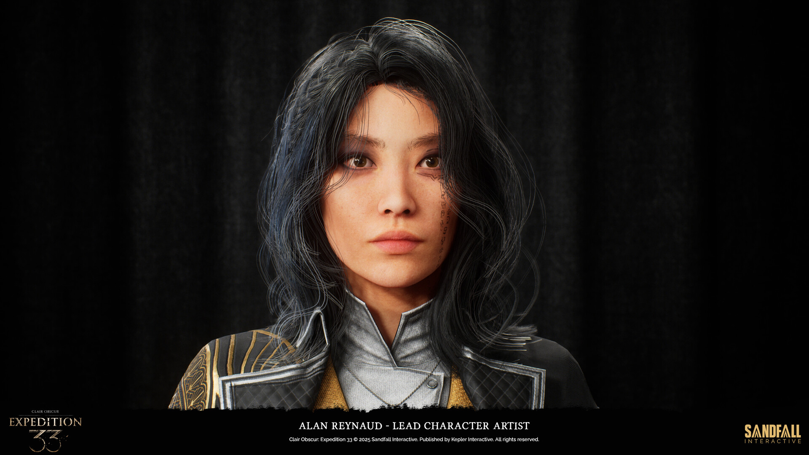

# ASSIGNMENT 2 

*Ascesa, declino e rinascita di un'idea*

---

## La reference: Expedition 33

**Obiettivo:** ricreare la scena del litigio tra Gustave e Lune.

::: {.columns}
::: {.column width="50%"}
{width=100%}
:::
::: {.column width="50%"}
{width=100%}
{width=100%}

:::
:::

---

## Tentativo 1 — MetaHuman Editor diretto

Partire dalle **mesh base di MH** e "copiare" il volto a occhio.

::: {.columns}
::: {.column width="50%"}
{width=50%}
{width=100%}
:::
::: {.column width="50%"}
**Problemi riscontrati:**

- Personalizzazione limitata
- Effetto **uncanny valley**: modificata una parte, il resto non torna più
- Impossibile ottenere una somiglianza credibile
:::
:::

---

## Tentativo 2 — FaceBuilder su Blender

**Workflow:** scan facciale → MH Identity → import in Unreal

{width=70% fig-align="center"}

---

## Tentativo 2 — Risultato

{width=70% fig-align="center"}

---

## Soluzione - Metahuman di Dario e Federico

Si porta il concetto di "post mortem" all'estremo: abbiamo realizzato i nostri metahuman per farli discutere sul precedente fallimento.

::: {.columns}
::: {.column width="50%"}

:::
::: {.column width="50%"}

:::
:::

---

## Soluzione - Metahuman di Dario e Federico

::: {.columns}
::: {.column width="50%"}

:::
::: {.column width="50%"}

:::
:::

---

## Character Creation Workflow


```
Video selfie rotante  →  Reality Scan  →  Scan pulito
      →  MH Identity  →  MetaHuman base  →  Vestiti + capelli
```

::: {.columns}
::: {.column width="50%"}
**Federico**

- Capelli importati da asset esterni
- Clothes importati e fittati

{width=100%}
:::
::: {.column width="50%"}
**Dario**

- Barba e baffi da libreria MH
- Clothes importati e fittati

{width=100%}
:::
:::

---

## Capelli su Blender — e perché l'abbiamo abbandonato

**Tentativo:** Blender → Alembic → Groom Asset in Unreal

::: {.columns}
::: {.column width="50%"}
{width=100%}

*Il lavoro su Blender era venuto bene...*
:::
::: {.column width="50%"}
{width=100%}

*...ma l'import in Unreal e il matching erano problematici.*
:::
:::


# ASSIGNMENT 3 

*Realizzazione di una cutscene*

---

## L'idea: la Gag

**Ispirazione:** la lezione del professore sul *Post Mortem*.

**Concept:** Fede e Dario attorno a un tavolo operatorio, con Gustave-patient-zero sdraiato.

::: {.columns}
::: {.column width="60%"}
```
Zenitale sul tavolo, push in sul metahuman sdraiato.

Dario: "Ma come ti è venuto in mente di partire da Blender
        per poi passare su Unreal e pensare che venisse una cosa decente?"

Fede:  "Vabè almeno ci ho provato, non è che possiamo fare
        le cose giuste al primo tentativo"

Dario: "Ho capito ma ti rendi conto di quello che ho dovuto fare
        per farlo sembrare un minimo accettabile?"

Fede:  "Eh sì che lo vedo, guarda quel naso lì, e poi manco hai
        cambiato il preset di base di metahuman"

Dario: "Magari con una mesh decente di partenza avrei avuto
        anche più voglia di farlo giusto"
```
:::
::: {.column width="40%"}

:::
:::

---

## L'ambiente

Location creata per la prima consegna. Verrà riutilizzata invariata.

::: {.columns}
::: {.column width="50%"}
{width=100%}
:::
::: {.column width="50%"}
{width=100%}
:::
:::

---

## Body Mocap — Cartwheel

**Valutazione strumenti IA** per il mocap del corpo:

| Strumento | Pro | Contro |
|-----------|-----|--------|
| Cartwheel | Qualità output, workflow pulito | Solo 30', ma arbitrari |
| Quickmagic | Qualità dell'output | Solo i primi 30', sistema a crediti |
| RADiCAL | Qualità dell'output | Solo i primi 20', sistema a crediti |

Abbiamo optato per Cartwheel.

---

## Body Mocap Grezzo (Dario) - Risultato

```
Ripresa con cellulare  →  Cartwheel  →  Trasposizione sulla mesh MH
```

::: {.columns}
::: {.column width="50%"}
{width=100%}
:::
::: {.column width="50%"}
{width=100%}
:::
:::

---

## Body Mocap Grezzo (Federico)- Risultato

```
Ripresa con cellulare  →  Cartwheel  →  Trasposizione sulla mesh MH
```

::: {.columns}
::: {.column width="50%"}
{width=100%}
:::
::: {.column width="50%"}
{width=100%}
:::
:::

---

## Correzioni alle Animazioni — Additive Track

Il risultato grezzo di Cartwheel richiedeva correzioni manuali nel Sequencer.

::: {.columns}
::: {.column width="50%"}
**Interventi:**

- Posizione **dita e mani**
- Rotazione **occhi**
- Ancoraggio **piedi a terra** (entrambe le riprese zenitali)
:::
::: {.column width="50%"}
{width=100%}
:::
:::

---

## Face Mocap — Live Link

**Workflow:**

```
Ripresa con cellulare  →  Live Link  →  Trasposizione sulla mesh MH
```

::: {.columns}
::: {.column width="50%"}
{width=100%}
:::
::: {.column width="50%"}
{width=100%}
:::
:::

---

## Le Inquadrature — Camera Cuts

Cinque inquadrature principali, alternate tramite **Camera Cuts** in Unreal.

| # | Inquadratura | Focale | Motivazione |
|---|-------------|--------|-------------|
| 1 | Totale sulla casa | **200mm** | Taglio familiare e accogliente |
| 2 | Zenitale sul tavolo | **30mm** | Ampia visione della scena |
| 3 | Su Dario | **30mm** | Dialogo |
| 4 | Su Federico | **30mm** | Dialogo |
| 5 | Dettaglio naso Gustave | **85mm** | Close-up di qualità |

1 -> 2 -> 3 -> 4 -> 5 -> 2

---

## Illuminazione

**Setup a tre luci:**

::: {.columns}
::: {.column width="40%"}
**Key light**
Rect Light dalla finestra

**Fill light**
Ray tracing ambientale

**Rim light**
Due Rect Light dietro ai personaggi
:::
::: {.column width="60%"}
{width=100%}
:::
:::

---

## Risultato Finale



{width=80% fig-align="center"}

---

## Lessons Learned

::: {.columns}
::: {.column width="50%"}
**Cosa ha funzionato ✅**

- Reality Scan → MH Identity: workflow solido
- Live Link per face mocap: risultato convincente
- Cartwheel per il body mocap
- Il pivot creativo stesso: trasformare un fallimento in contenuto
:::
::: {.column width="50%"}
**Cosa non ha funzionato ❌**

- MH Editor diretto per somiglianza
- FaceBuilder → texture workflow
- Blender hair → Groom Asset in Unreal
:::
:::

---

# Grazie per l'attenzione!

*Federico & Dario*
